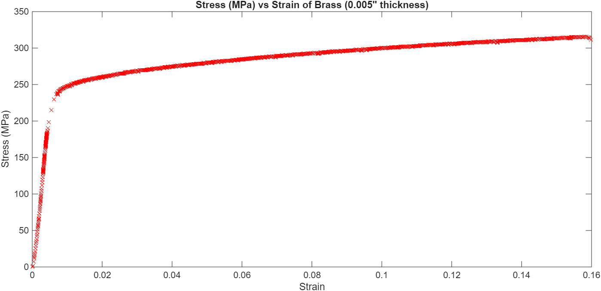
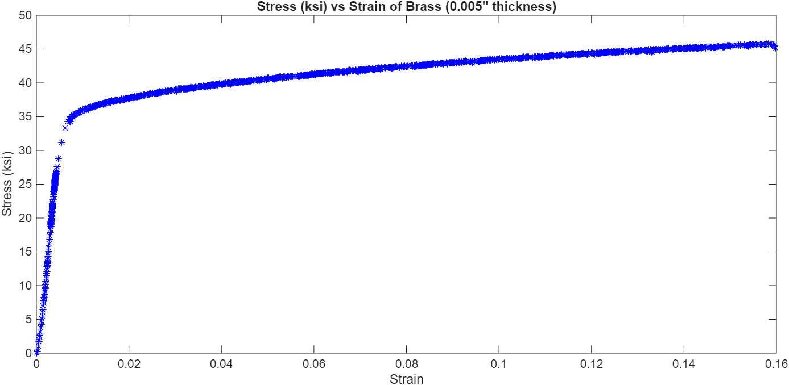
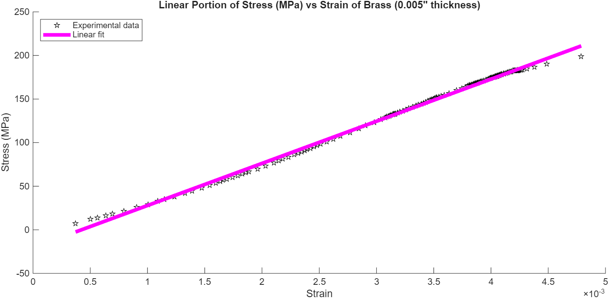
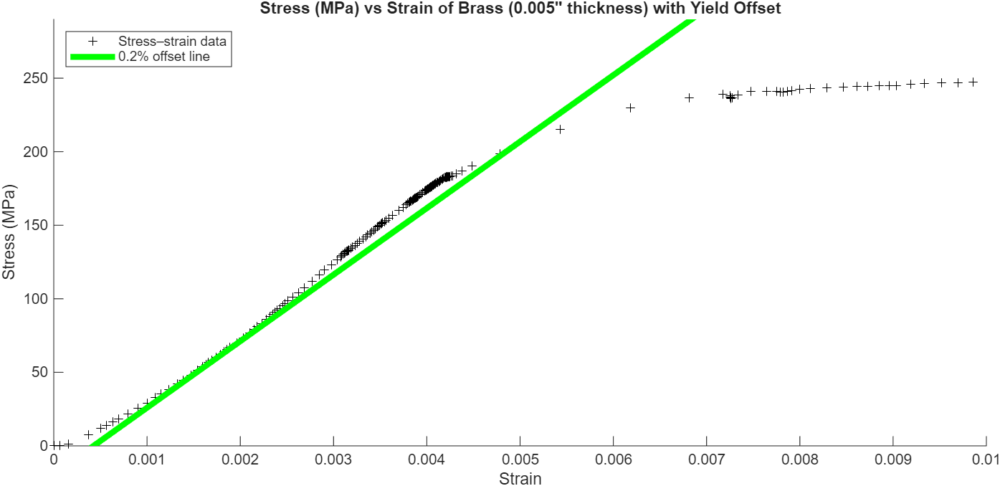

# Brass Material Analysis (MATLAB)

This project utilizes MATLAB to perform a comprehensive tensile test analysis on a brass specimen. By processing raw force and elongation data, the script automates the calculation of fundamental mechanical properties and provides high-fidelity visualizations of material behavior.

## Key Mechanical Properties Computed:
- **Modulus of Elasticity (E)**: Determined via linear regression of the elastic region.
- **Yield Strength**: Calculated using the **0.2% Offset Method**.
- **Ultimate Tensile Strength (UTS)**
- **Fracture Stress**.
- **Toughness**: Calculated through numerical integration (Area under the curve).

--------------------------------------------

## Data Description

The file B5_4.csv contains raw tensile test measurements:

- Column 1: Applied force (N)
- Column 2: Elongation (mm)

The script converts this into engineering quantities:

- Strain = ΔL / L0
- Stress = F / A (reported in MPa and ksi)

Specimen parameters:
- Initial gauge length: 78 mm
- Cross-sectional area: 0.506 mm²

--------------------------------------------

## Analysis Visualizations
The following plots were generated to validate the material properties and visualize the specimen's transition from elastic to plastic deformation.

### 1. Stress-Strain Response
These plots represent the full material behavior from initial loading to fracture.

| Metric (MPa) | Metric (ksi) |
| :--- | :--- |
|  |  |

### 2. Engineering Calculations
To derive specific properties, the script isolates the elastic region and applies standard engineering approximations.

| Linear Elastic Fit | 0.2% Offset Yield Method |
| :--- | :--- |
|  |  |
| *Linear regression (polyfit) used to calculate Young's Modulus.* | *Graphical intersection used to determine the Yield Point.* |

--------------------------------------------

## What the Script Does

1. Loads and processes tensile test data  
2. Computes stress and strain  
3. Creates stress–strain plots (MPa and ksi)  
4. Extracts elastic region and fits a linear regression  
5. Computes modulus of elasticity using polyfit  
6. Uses trapz to integrate toughness  
7. Applies the 0.2% offset method to estimate yield strength  
8. Prints a summary table including:  
   - Modulus of elasticity  
   - Yield strength  
   - UTS  
   - Fracture stress  
   - Toughness  

--------------------------------------------

## How to Run

Requirements:
- MATLAB
- 'Brass_Material_Analysis.m'
- 'B5_4.csv'

Steps:
1. Open MATLAB  
2. Set Current Folder to this project  
3. Run: 'Brass_Material_Analysis'
4. View generated figures  
5. Read mechanical property results printed in the Command Window  

--------------------------------------------

## Skills Demonstrated

- MATLAB programming
- Mechanical engineering analysis
- Stress–strain interpretation
- Linear regression (polyfit)
- Numerical integration (trapz)
- 0.2% offset yield method
- Data visualization
- Engineering report preparation

--------------------------------------------

## Possible Extensions

- Automatically compute yield point intersection
- Support multiple specimens or materials
- Export summary tables and plots to a PDF report
- Convert script into reusable MATLAB functions
